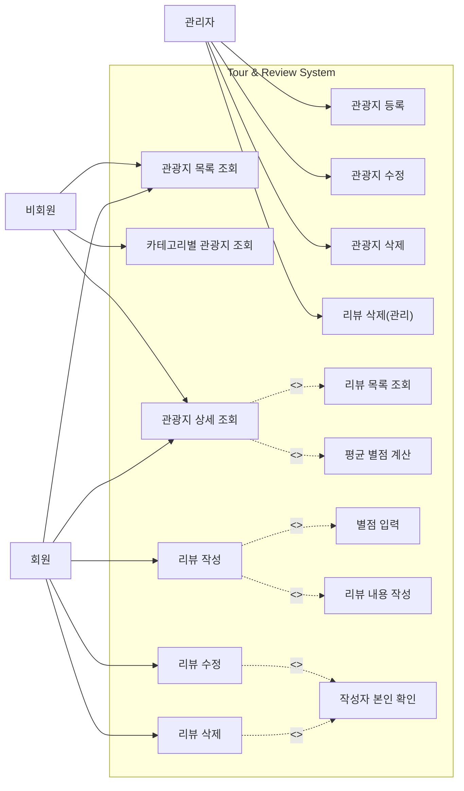
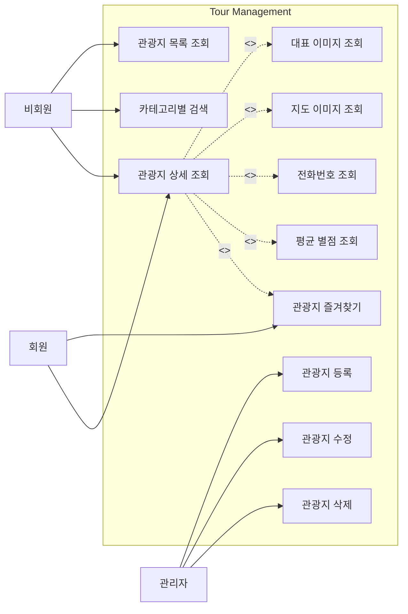
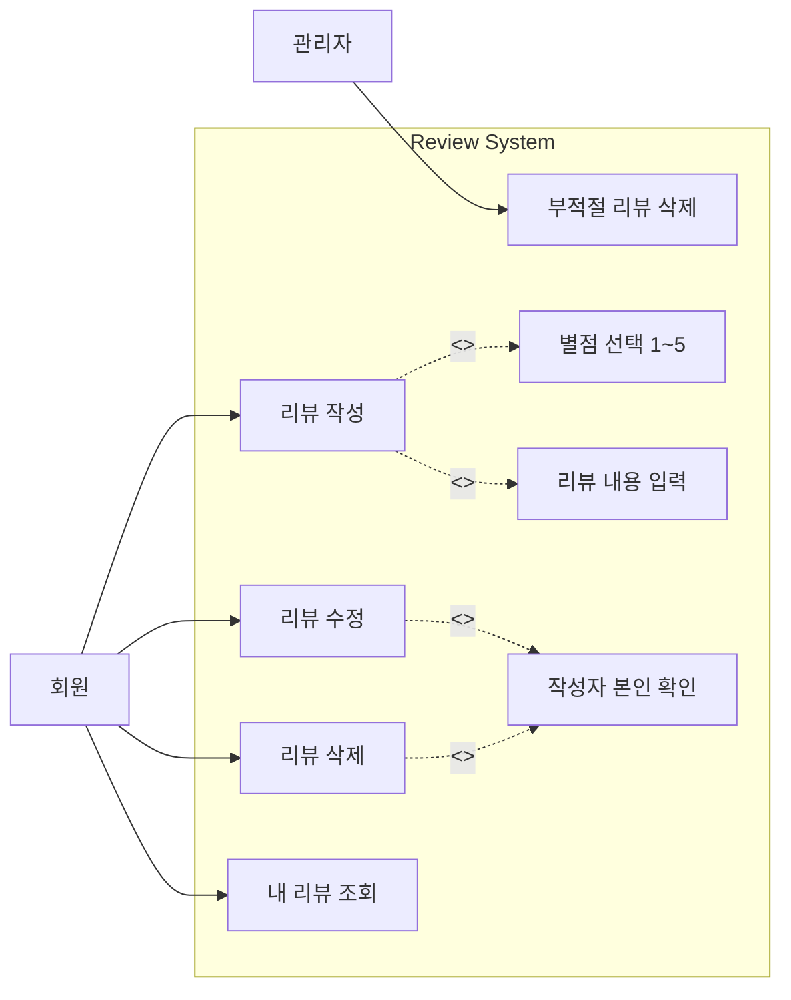
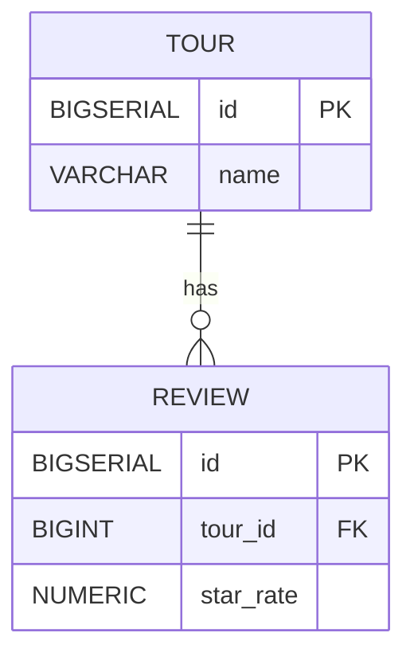
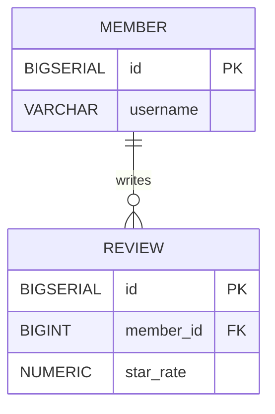
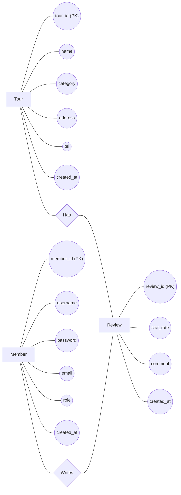
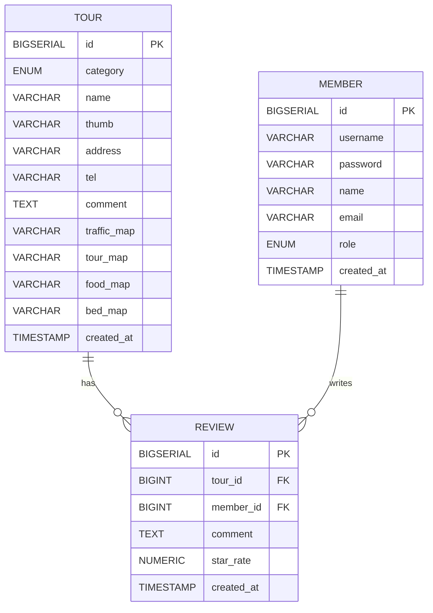

## 개념적 설계

### 1. Tour & Review System Use Case (GitHub 호환용)



<br>

### 2. Tour Management Use Case (GitHub 호환용)



<br>

### 3. Review Management Use Case (GitHub 호환용)




<br><br><br>

**아래 mermaid 코드들은 현재 gitHub나 VS Code에서 usecaseDiagram를 지원하지 않아 출력이 되지 않고, 오류가 발생합니다.**


```mermaid
usecaseDiagram
title Tour & Review System Use Case Diagram

actor Guest as 비회원
actor Member as 회원
actor Admin as 관리자

rectangle "Tour System" {

Guest --> (관광지 목록 조회)
Guest --> (카테고리별 관광지 조회)
Guest --> (관광지 상세 조회)

Member --> (관광지 목록 조회)
Member --> (관광지 상세 조회)
Member --> (리뷰 작성)
Member --> (리뷰 수정)
Member --> (리뷰 삭제)

Admin --> (관광지 등록)
Admin --> (관광지 수정)
Admin --> (관광지 삭제)
Admin --> (리뷰 삭제(관리))

(관광지 상세 조회) ..> (리뷰 목록 조회) : <<include>>
(관광지 상세 조회) ..> (평균 별점 계산) : <<include>>

(리뷰 작성) ..> (별점 입력) : <<include>>
(리뷰 작성) ..> (리뷰 내용 작성) : <<include>>

(리뷰 수정) ..> (작성자 본인 확인) : <<include>>
(리뷰 삭제) ..> (작성자 본인 확인) : <<include>>

}
```

```mermaid
usecaseDiagram
title Tour Management Use Case

actor Guest as 비회원
actor Member as 회원
actor Admin as 관리자

rectangle "Tour Management" {

  Guest --> (관광지 목록 조회)
  Guest --> (카테고리별 검색)
  Guest --> (관광지 상세 조회)

  Member --> (관광지 즐겨찾기)
  Member --> (관광지 상세 조회)

  Admin --> (관광지 등록)
  Admin --> (관광지 수정)
  Admin --> (관광지 삭제)

  (관광지 상세 조회) ..> (대표 이미지 조회) : <<include>>
  (관광지 상세 조회) ..> (지도 이미지 조회) : <<include>>
  (관광지 상세 조회) ..> (전화번호 조회) : <<include>>
  (관광지 상세 조회) ..> (평균 별점 조회) : <<include>>

}

```


```mermaid
usecaseDiagram
title Review Management Use Case

actor Member as 회원
actor Admin as 관리자

rectangle "Review System" {

  Member --> (리뷰 작성)
  Member --> (리뷰 수정)
  Member --> (리뷰 삭제)
  Member --> (내 리뷰 조회)

  Admin --> (부적절 리뷰 삭제)

  (리뷰 작성) ..> (별점 선택 1~5) : <<include>>
  (리뷰 작성) ..> (리뷰 내용 입력) : <<include>>

  (리뷰 수정) ..> (작성자 본인 확인) : <<include>>
  (리뷰 삭제) ..> (작성자 본인 확인) : <<include>>

}

```


<br><br>

## 논리적 관계

① Tour — Review 관계
- 1 : N 관계
- 하나의 관광지는 여러 개의 리뷰를 가질 수 있다
- 하나의 리뷰는 하나의 관광지에만 속한다



- `||` → 반드시 하나 (1)<br>
- `o{` → 여러 개 (N)<br>
- TOUR `1 : N` REVIEW 관계<br>
- REVIEW의 `tour_id`는 TOUR의 PK를 참조하는 FK<br>


② Member — Review 관계
- 1 : N 관계
- 한 회원은 여러 개의 리뷰를 작성할 수 있다
- 하나의 리뷰는 한 명의 회원이 작성한다



- MEMBER 1 : N REVIEW 관계
- REVIEW의 member_id는 MEMBER의 PK를 참조하는 FK
- 한 회원이 여러 리뷰를 작성 가능
- 한 리뷰는 반드시 한 회원에 속함

<br>

### 정보공학적 ERD (Chen 스타일)



<br><br>

## 물리적 ERD


